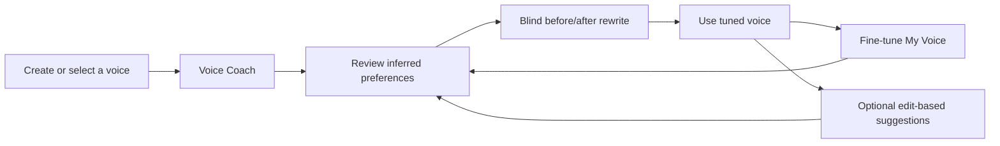

# Personal Voice Calibration Plan

> Implementation status (2026-07-18): phases 0-6 are implemented. StyleMakar
> now includes the curated seven-dimension Voice Coach, editable versioned
> preferences and evidence, resumable sessions, blinded prior-versus-tuned
> proof, focused fine-tuning, opt-in meaning-gated adaptive comparisons across
> browser and Tauri paths, and explicitly approved learning from accepted edits.
> Phase 7's deterministic personalisation gate and product journeys are also in
> place. The external blinded human-preference study remains pending because it
> requires independent reviewers and real preference data; no efficacy threshold
> is claimed yet. The curated pairs have deterministic meaning annotations and
> regression coverage but still need independent content review before they are
> treated as gold calibration data.

## Summary

Make personal voice tuning part of StyleMakar itself. A user should not need to
understand prompt engineering, maintain a separate evaluation dataset, or write
style rules from scratch. The app should lead them through concrete writing
choices, infer tentative preferences, let them correct those inferences, and
show whether the tuned voice actually produces better results for them.

The product will have two complementary entry points:

1. **Voice Coach**: a short, approachable setup flow that establishes an initial
   voice from 6-8 curated choices.
2. **Fine-tune My Voice**: an optional calibration mode that isolates one style
   dimension at a time and lets an existing user sharpen or correct the profile.

A later **learn from my edits** feedback loop can suggest preferences based on
accepted changes during ordinary rewriting. It must never update the voice
silently.

This is guided voice calibration and preference learning, not model fine-tuning.
The first implementation updates the existing `VoiceProfileRecord` used by the
rewrite pipeline. It does not train model weights, upload a private corpus, or
claim to reproduce a person's identity from a few choices.

In product copy, prefer **Teach StyleMakar your voice**, **Voice Coach**, and
**Guided voice calibration**. Keep **Fine-tune my voice** as the name of the
focused adjustment mode, while explaining that it changes the user's editable
voice profile rather than training model weights.

## MVP Sequencing Decision

The first release should validate the interaction and the resulting preference
profile before introducing live AI-generated calibration questions.

Build in this order:

1. curated Voice Coach across 6-8 clear style dimensions
2. blinded prior-versus-tuned comparison
3. focused Fine-tune My Voice mode using the reviewed comparison bank
4. adaptive AI-generated comparisons
5. explicitly approved suggestions based on normal edits

This sequencing reduces latency and provider dependence during onboarding,
prevents weak or meaning-changing generated pairs from undermining trust, and
makes the central product hypothesis inexpensive to test: after a short guided
calibration, does the user prefer the tuned output?

## Product Outcomes

- A new user can create a useful personal voice without manually authoring
  rules or anti-rules.
- An experienced user can deliberately test and adjust qualities such as
  directness, warmth, formality, concision, rhythm, vocabulary, and explanation
  structure.
- Every inferred preference is visible, editable, removable, and supported by
  evidence the user supplied.
- The app demonstrates the effect of tuning with a blinded before-and-after
  comparison.
- Meaning preservation remains a hard constraint while style preferences are
  explored.
- Documents, choices, and learned preferences remain local unless the user has
  selected a remote model provider, in which case the existing disclosure
  continues to apply.

## Product Principles

### Ask about examples, not abstractions

Most users cannot reliably answer questions such as "How much nominalization do
you prefer?" They can answer "Which version sounds more like you?" The default
interaction should therefore use concrete A/B examples and reserve direct rule
editing for the voice library.

### Keep comparisons blind and balanced

Candidates are labelled A and B, their order is randomized, and neither option
is described as the app's preferred answer. Users can choose A, B, tie, neither,
or write their own version.

### Treat inferences as tentative

One choice is weak evidence. Preferences become stronger only when multiple
choices agree. The UI distinguishes `tentative`, `confirmed`, and `user-set`
preferences and avoids false precision.

### Preserve user control

The app explains what it inferred and why. The user can edit, reject, reset, or
delete any preference. Edit-based learning is opt-in per suggestion, not a
background collection process.

### Prove value in the product

Completing a questionnaire is not success. At the end of calibration, the user
sees two blinded rewrites of the same text: one using the prior voice and one
using the tuned voice. Their preference becomes the first efficacy signal for
the new profile.

## Experience Architecture



### Entry points

- Add **Style Lab** to the main navigation.
- Show **Train this voice** for a new or minimally configured voice.
- Show **Fine-tune my voice** for a voice with completed calibration.
- Keep **Edit voices and examples** as the direct, advanced management surface.
- Offer calibration after voice creation, but allow the user to skip it.

### Voice Coach

The coach is a focused, one-question-at-a-time flow.

1. Ask what the voice is for, using broad choices such as everyday writing,
   professional writing, teaching or feedback, technical explanation, or a
   custom goal.
2. Ask whether to use neutral built-in passages or user-provided writing. Do not
   require personal documents to begin.
3. Present 6-8 curated A/B comparisons. Each comparison changes primarily one
   style dimension while preserving the same meaning.
4. Allow `A`, `B`, `tie`, `neither`, and `edit my own` responses.
5. Show progress and a compact emerging-voice summary, with tentative language.
6. End with a review screen where inferred preferences can be accepted, edited,
   or removed before they affect rewriting.
7. Run the blinded prior-versus-tuned rewrite comparison and ask which version
   the user would rather use.

The session should take roughly three to five minutes, support stopping and
resuming, and produce a useful voice even when the user stops early.

### Fine-tune My Voice

Fine-tuning uses the same reviewed comparison mechanic with more control. Live
adaptive generation can enhance this mode after the curated flow proves useful.

- Let the user choose a focus: directness, warmth, formality, concision, rhythm,
  vocabulary, explanation shape, or `surprise me`.
- Generate a short sequence that isolates that dimension instead of changing
  many qualities at once.
- Show the dimension explanation after the user chooses, so the label does not
  bias the decision.
- Display which existing preference would change and how much evidence supports
  the change.
- Require confirmation before replacing a user-set rule or reversing a strong
  existing preference.
- Allow a user to test a proposed change with a one-off rewrite before saving it.

Fine-tune mode is also the recovery path when the normal rewrite does not sound
right: `This doesn't sound like me` should offer to launch a focused calibration
based on the mismatch.

### Learn From My Edits — Later Phase

After a user edits or accepts a rewrite, StyleMakar can compare generated and
edited text and propose a small number of human-readable observations, for
example:

> You shortened the opening and removed two hedges. Save either of these as a
> voice preference?

Each observation has `save`, `review`, and `not this time` actions. Dismissing a
suggestion does not create a negative preference unless the user explicitly
asks the app not to suggest it again. The original and edited excerpts are kept
as evidence only within the local voice profile and can be deleted.

## Data Model

Extend the voice schema rather than creating a separate user-training system.
The pipeline already consumes the voice's rules, anti-rules, and reference
examples, so confirmed preferences should compile into those existing inputs.

```ts
type VoicePreferenceDimension =
  | 'directness'
  | 'warmth'
  | 'formality'
  | 'concision'
  | 'rhythm'
  | 'vocabulary'
  | 'explanation-shape'
  | 'custom';

type VoicePreference = {
  id: string;
  dimension: VoicePreferenceDimension;
  instruction: string;
  avoidInstruction?: string;
  status: 'tentative' | 'confirmed' | 'user-set';
  confidence: 'low' | 'medium' | 'high';
  source: 'coach' | 'fine-tune' | 'edit-suggestion' | 'manual';
  evidenceIds: string[];
  createdAt: string;
  updatedAt: string;
};

type VoicePreferenceEvidence = {
  id: string;
  sourceText: string;
  candidateA?: string;
  candidateB?: string;
  selected: 'a' | 'b' | 'tie' | 'neither' | 'custom';
  customText?: string;
  dimension: VoicePreferenceDimension;
  createdAt: string;
};

type VoiceCalibrationSession = {
  id: string;
  voiceProfileId: string;
  mode: 'coach' | 'fine-tune';
  status: 'active' | 'completed' | 'abandoned';
  focus?: VoicePreferenceDimension;
  questionIds: string[];
  startedAt: string;
  completedAt?: string;
};
```

Add `preferences`, `preferenceEvidence`, and `calibrationSessions` to
`VoiceProfileRecord`, then migrate it to schema version 2. Keep session-level
candidate generation metadata separate from the rules applied to rewrites.

Storage changes must include:

- browser validation and migration in `src/client/storage.ts`
- shared content-store validation in `src/client/contentRepository.ts`
- atomic Tauri persistence through the existing content-store command
- backup, restore, voice import, and voice export schema migration
- reasonable size limits for evidence text and bounded session history
- deletion and reset behavior that removes associated evidence

## Preference Inference

The initial implementation should be understandable and testable rather than a
free-form agent that rewrites the voice profile after every answer.

1. Define a small versioned catalogue of supported preference dimensions.
2. Generate or select comparison pairs against one declared dimension.
3. Record the choice as evidence.
4. Aggregate repeated evidence with simple documented rules.
5. Ask the model to phrase a concise preference instruction when needed.
6. Validate that instruction against the chosen evidence and show it to the
   user before confirmation.
7. Compile confirmed preferences deterministically into `rules` and
   `antiRules`; keep manually authored rules intact.

The model may lead the conversation and propose language, but it does not have
unrestricted authority to mutate the profile. Candidate generation, inference,
and saving are separate operations.

## Comparison Contract

Add a shared Style Lab service used by both browser/Express and Tauri runtimes.
Do not implement the feature only as a browser endpoint. The contract must
support two sources without making the MVP depend on both:

- `curated`: versioned, reviewed pairs bundled with the app
- `generated`: provider-created adaptive pairs introduced after the MVP

The comparison request contains:

- active voice snapshot
- declared preference dimension
- source passage and immutable meaning details
- previous session answers needed for adaptation
- selected provider and model when the source is `generated`

The response contains:

- candidates A and B
- the hidden trait represented by each candidate
- a meaning check for each candidate
- source kind, catalogue or prompt-contract version, and concise diagnostics

Curated pairs must be reviewed and mechanically validated before release.
Generated pairs must be rejected or regenerated when either candidate fails
meaning preservation, contains malformed output, or changes more than the
intended dimension. Provider compatibility is required only for custom and
adaptive examples, not for completing the curated Voice Coach.

Candidate order is randomized on the client after generation and the stored
record retains the mapping for reproducibility.

## UI Structure

`src/client/App.tsx` is already large and currently contains the voice manager
inline. Before adding the full flow, extract feature components and stateful
hooks rather than extending the monolith further.

Suggested structure:

```text
src/client/style-lab/
  StyleLab.tsx
  VoiceCoach.tsx
  FineTuneVoice.tsx
  PreferenceComparison.tsx
  PreferenceReview.tsx
  CalibrationResult.tsx
  useCalibrationSession.ts
src/shared/styleLab.ts
src/server/styleLab.ts
```

The existing voice manager gains:

- a calibration status and last-updated summary
- `Teach StyleMakar your voice` or `Fine-tune my voice`
- a learned-preferences list with evidence, edit, and delete controls
- a reset action that does not delete manual examples or rules

Mobile uses the same flow as a full-height sheet or dedicated view with one
candidate visible at a time and an explicit A/B switch. Desktop keeps the two
candidates equally weighted side by side.

## Before/After Proof

At calibration completion, generate two candidates from the same source:

- the voice snapshot from before the session
- the proposed tuned voice

Randomize and blind their order. Ask:

- which sounds more like you?
- did either change the meaning?
- would you use the preferred version as-is, edit it, or reject both?

Store this result as local calibration evidence. If the tuned voice loses or
both are rejected, keep the new preferences in review rather than silently
activating them. Offer another focused comparison or manual editing.

This product-level comparison complements the repository eval suite. It does
not replace independent efficacy evaluation because it uses one user, one
voice, and a small number of examples.

## Evaluation And Quality Strategy

Reuse the existing black-box eval and dataset-v2 infrastructure where possible.
Add a separate personalisation suite so aggregate rewrite quality and individual
preference learning are not conflated.

### Deterministic tests

- preference aggregation and confidence transitions
- randomised A/B mapping and persisted answer recovery
- voice schema migration, import/export, backup, and deletion
- manual rules surviving preference recompilation
- candidate rejection when meaning checks fail
- resuming and abandoning calibration sessions
- no preference mutation before explicit confirmation

### Product integration tests

- create voice, complete a short coach session, review preferences, and rewrite
- stop and resume a coach session across reload
- fine-tune one dimension without altering unrelated preferences
- reject both candidates and enter a custom alternative
- compare prior and tuned snapshots with order blinded
- use the same flow through browser and Tauri adapters
- complete the flow with keyboard-only navigation and screen-reader labels

### Personalisation efficacy dataset

Build paired examples where the same source is rewritten for intentionally
different voice profiles. Measure:

- profile differentiation without meaning loss
- whether inferred preferences predict held-out user choices
- prior-versus-tuned blind preference win rate
- rejection and `neither` rate
- preference stability when similar questions are repeated
- contradictory-choice handling
- percentage accepted without editing
- edit distance and time-to-acceptable-output

Keep private user sessions out of the committed dataset by default. Add an
explicit export that redacts metadata and previews every included passage if a
user chooses to contribute examples.

## Implementation Phases

### Phase 0: Curated Catalogue, Contract, And Baseline

- Finalise the supported preference dimensions and plain-language labels.
- Build a reviewed comparison bank covering 6-8 supported dimensions.
- Freeze current rewrite results for a small multi-profile validation slice.
- Specify prompt contracts for paired generation and preference phrasing.
- Decide evidence history limits and backup compatibility.

Acceptance criteria:

- Every supported dimension has positive and negative examples.
- Candidate pairs change one primary dimension and preserve annotated meaning.
- Existing voice behavior has a named baseline before prompt changes begin.
- The complete MVP coach can run without generating live comparison questions.

### Phase 1: Voice Schema And Local Persistence

- Add preference, evidence, and session types.
- Implement schema-v1-to-v2 migrations and validation.
- Update browser, Tauri, backup, restore, and voice import/export paths.
- Add preference compilation that preserves manual rules.
- Add unit tests for migration, reset, deletion, and size limits.

Acceptance criteria:

- Existing installations migrate without losing documents, voices, or examples.
- A session can be stopped, reloaded, and resumed.
- Resetting learned preferences leaves manual voice content unchanged.

### Phase 2: Curated Comparison Engine

- Implement versioned curated pair selection and validation.
- Randomize presentation order independently of candidate generation.
- Implement evidence aggregation and tentative preference proposals.
- Add the shared comparison contract behind browser/Express and Tauri adapters,
  while keeping curated sessions provider-independent.

Acceptance criteria:

- The same request contract works in both runtimes.
- Unreviewed or invalid pairs never reach the comparison screen.
- The model cannot save or confirm a preference directly.
- The MVP coach remains usable when no provider is configured or available.

### Phase 3: Voice Coach MVP

- Extract Style Lab components and calibration state from `App.tsx`.
- Add navigation, entry points, progress, A/B choices, and emerging preferences.
- Implement pause, resume, neither, tie, and custom-edit paths.
- Add the preference review and blinded prior-versus-tuned result.
- Add desktop, mobile, accessibility, and deterministic Playwright coverage.

Acceptance criteria:

- A new voice can become rewrite-ready through 6-8 guided choices.
- No inferred rule is activated without a review step.
- The completion screen provides a real blinded comparison, not a self-score.
- The user can undo calibration without deleting the voice.

### Phase 4: Fine-tune My Voice

- Add dimension selection and `surprise me`.
- Select focused sequences from the reviewed comparison bank.
- Explain the tested dimension only after each choice.
- Add one-off rewrite previews before saving a proposed change.
- Connect `This doesn't sound like me` from rewrite review to focused tuning.

Acceptance criteria:

- Fine-tuning one dimension does not overwrite unrelated preferences.
- Strong or manually authored rules require explicit replacement confirmation.
- A user can see the exact profile change and test its effect before saving.

### Phase 5: Adaptive AI-Generated Comparisons

- Add provider-generated pairs for custom goals and under-explored dimensions.
- Adapt later questions using the current preference state and earlier answers.
- Add meaning-preservation gating, bounded retry, timeout, and cancellation.
- Record prompt-contract and provider metadata for reproducibility.
- Fall back to curated pairs when generation is unavailable or unsafe.

Acceptance criteria:

- Generated candidates isolate one declared dimension and preserve meaning.
- Failed checks never reach the user as valid choices.
- Provider failures do not prevent access to curated calibration.
- Adaptive sessions outperform or add useful coverage beyond the curated flow
  in held-out preference tests before becoming the default.

### Phase 6: Learn From Edits

- Detect a bounded set of meaningful edit patterns after a rewrite.
- Present reviewable preference suggestions with before/after evidence.
- Add per-suggestion save, edit, dismiss, and do-not-suggest controls.
- Keep suggestion generation local to the configured provider path.

Acceptance criteria:

- Ordinary editing never mutates the voice automatically.
- Suggestions are concise, evidence-backed, and individually reversible.
- Users can delete retained evidence without deleting the resulting manual rule.

### Phase 7: Personalisation Efficacy And Release Gate

- Add the paired personalisation dataset and held-out choice-prediction tests.
- Compare prior, tuned, and one-shot outputs with blinded human review.
- Report meaning failures separately from preference wins.
- Establish release thresholds only after collecting a credible baseline.

Initial decision thresholds to validate, not assume:

- zero known high-risk meaning regressions introduced by comparison generation
- at least 60% tuned-voice preference over the prior voice, with ties reported
- decreasing `neither` rate across a session rather than forced choices
- no regression in the existing dataset-v2 meaning release gate
- successful completion and resume behavior across desktop and mobile journeys

## Primary Files

- `src/shared/types.ts`
- `src/shared/styleLab.ts` (new)
- `src/client/App.tsx`
- `src/client/style-lab/*` (new)
- `src/client/api.ts`
- `src/client/tauri.ts`
- `src/client/storage.ts`
- `src/client/contentRepository.ts`
- `src/server/api.ts`
- `src/server/styleLab.ts` (new)
- `src/server/lmStudio.ts`
- `src-tauri/src/lib.rs`
- `e2e/product-journeys.spec.ts`
- `evals/dataset-v2/*`
- `evals/reliability/scenarios.test.ts`

## Risks And Mitigations

### The AI changes several qualities at once

Use an explicit dimension contract, deterministic validation where possible,
and human-reviewed starter pairs. Reject comparisons whose candidates differ in
unrelated ways.

### Users over-trust a small sample

Use tentative language, broad confidence bands, and visible evidence. Never
display a pseudo-scientific percentage for a preference inferred from a handful
of choices.

### Calibration feels like work

Keep the coach short, show progress, allow stopping early, and demonstrate value
with an immediate rewrite. Fine-tuning stays optional and focused.

### Generated pairs introduce meaning errors

Annotate immutable facts, run meaning checks on both candidates, and keep
`neither` plus `meaning changed` reporting visible. Meaning safety overrides
style exploration.

### Private writing becomes an accidental training corpus

Default to built-in neutral passages, retain data locally, disclose remote
provider behavior, and require a previewed explicit export before any example
can be contributed to project evals.

### Learned rules become contradictory

Detect conflicts by dimension, show the affected existing rule, and require
confirmation before replacement. Preserve a recoverable profile history or
snapshot at each completed calibration session.

## Definition Of Done

The MVP is complete when a user can create or select a voice, complete or resume
a 6-8 choice curated calibration, inspect and correct every learned preference,
prove the effect through a blinded prior-versus-tuned rewrite, use the resulting
voice in the existing rewrite pipeline, and fine-tune one dimension without
disturbing the rest of the profile. All data must survive browser and Tauri
storage round trips, backups, imports, and migrations; meaning failures must be
blocked or surfaced; and the complete workflow must pass desktop, mobile,
keyboard, offline-calibration, and personalisation-efficacy gates. Adaptive
generation and edit-based learning are subsequent enhancements, not conditions
for validating the MVP.
